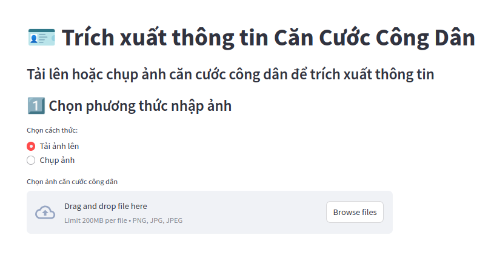
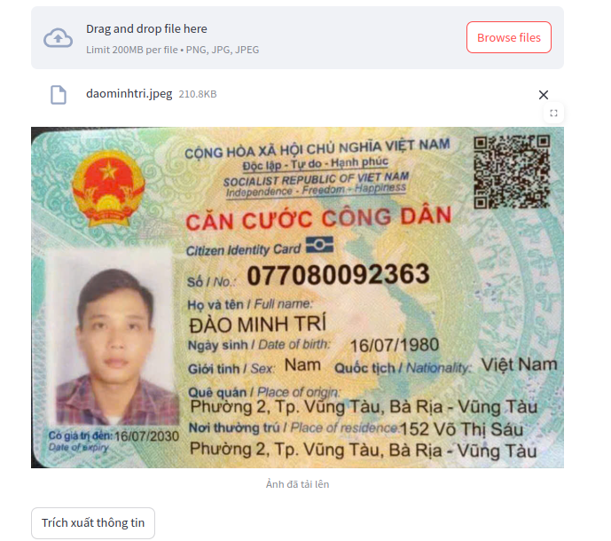
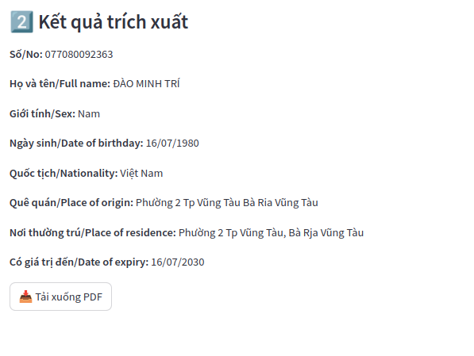

# OCR System with CRAFT and HTR-VT (CARD2FILE)

## DEMO




## 💡 Introduction

This project is an Optical Character Recognition (OCR) system designed for extracting text information from images. It integrates the **CRAFT** text detector and the **HTR-VT** handwriting text recognizer. The system processes images, detects text regions, recognizes their contents, and outputs the results in a structured JSON format.

## 📝 Description

### Key Features:
- **Text Detection**: Utilizes the CRAFT algorithm for detecting bounding boxes around text regions in images.
- **Text Recognition**: Employs HTR-VT for recognizing handwritten text within the detected regions.
- **Post-Processing**: Groups and organizes recognized text into meaningful entities (e.g., ID numbers, names, dates).
- **Frontend & Backend**: The system includes both a backend for text processing and a frontend(Streamlit) for visualization and interaction.

### Reference
#### This project builds on 2 papers:
- [CRAFT: Character Region Awareness for Text Detection](https://arxiv.org/pdf/1904.01941)
- [HTR-VT: Handwritten Text Recognition using Transformers](https://arxiv.org/html/2409.08573v1)

### Folder Structure:
```plaintext
├── docker-compose.yml        # Defines Docker services
├── README.md                 # Project documentation
├── system_backend            # Backend source code
│   ├── Dockerfile            # Backend container configuration
│   ├── pyproject.toml        # Backend Python project dependencies
│   └── src                   # Backend logic
│       ├── database          # Stores image and data
│       │   ├── craft_image   # Processed images from CRAFT
│       │   ├── data_output   # Final processed outputs
│       │   └── root_image    # Original input images
│       ├── detect_infor      # Text detection scripts
│       │   ├── run_craft.py  # Script for running the CRAFT detector
│       │   └── src           # Supporting detection scripts
│       ├── entrypoint.sh     # Docker entrypoint for backend
│       ├── main.py           # Backend service entry point
│       ├── ocr               # OCR system modules
│       │   ├── config        # Configuration files
│       │   ├── loader        # Data loading utilities
│       │   ├── model         # Neural network models
│       │   ├── optim         # Optimizers
│       │   ├── run_ocr.py    # OCR processing script
│       │   ├── tests         # Unit tests
│       │   ├── tool          # OCR utility scripts
│       │   └── train.py      # Training script for OCR models
│       ├── data_processing.py # Handles data transformations
│       └── weights           # Pre-trained model weights
│           └── craft_mlt_25k.pth # CRAFT pre-trained weights
└── system_frontend           # Frontend source code
    ├── Dockerfile            # Frontend container configuration
    ├── pyproject.toml        # Frontend Python project dependencies
    └── src                   # Frontend logic
        └── app.py            # Main application entry point

```
## ⚙️ Installation

### Download repository
```
git clone https://github.com/KittoDekiru1406/card2file.git
```

### Pre-trained

Download the Model files from the link in env file.

### Using app
```
docker compose up --build
```

## 🔗 Related
+ [CRAFT: Character Region Awareness for Text Detection](https://github.com/backtime92/CRAFT-Reimplementation/tree/craft)
+ [HTR-VT: Handwritten Text Recognition using Transformers](https://github.com/YutingLi0606/HTR-VT)
